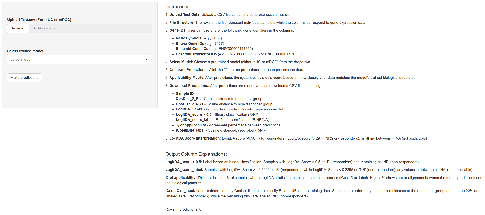
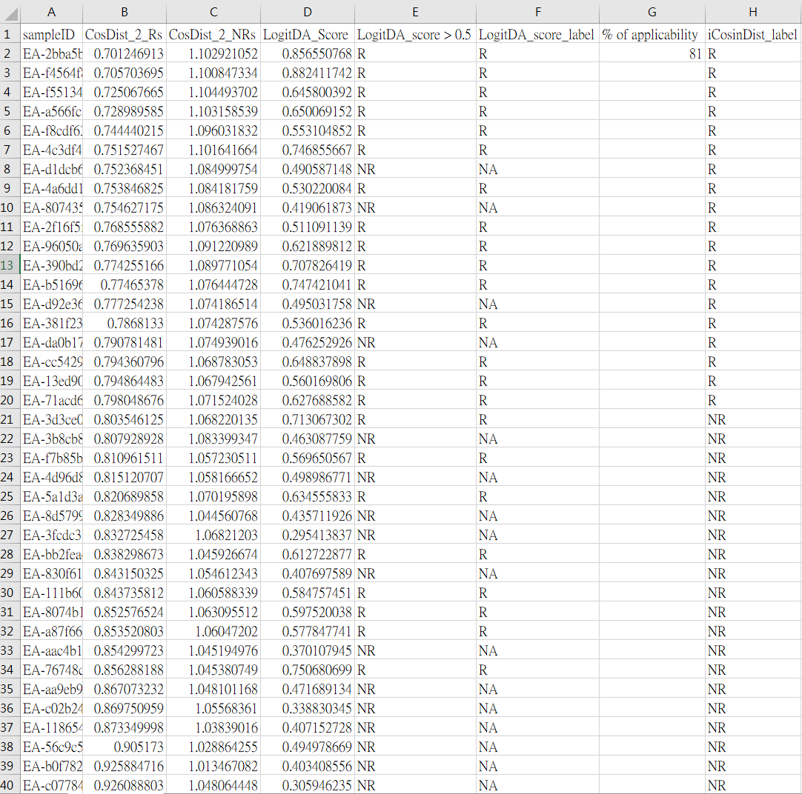

# 🧬 ImmunoResponse Predictor
## Gene Signature for Response Prediction to Immunotherapy and Prognostic Markers in Metastatic Urothelial Carcinoma

This repository contains the code and paper for the ImmunoResponse Predictor graphical user interface (GUI).

📖 Please read the full paper here: [Paper Link](https://pmc.ncbi.nlm.nih.gov/articles/PMC12675356/)

In practice, users upload RNA-seq log2-TPM profile datasets through the GUI. The tool outputs (1) each patient’s cosine distance to responders/non-responders and the corresponding predicted label, and (2) the cohort-level % applicability. High applicability (e.g., >70%) indicates that the new cohort lies in a similar expression space as the training data and that predictions align with the ORR-informed geometric. In such settings, per-patient predictions may support treatment selection or trial enrichment. Low applicability means that the cohort falls outside the model’s applicability domain, and predictions should not be considered to guide clinical decisions.

## User Interface


## GUI Input Data Required
To use the GUI tool, users upload a pre-treatment RNA-seq count or microarray expression matrix (.csv), containing either signature genes or whole-transcriptome data, from biopsy or surgical samples. Gene identifiers may be provided as gene symbols, Entrez IDs, Ensembl gene IDs, or Ensembl transcript IDs.

### Gene IDs

You can use one of the following gene identifiers in the columns:
- Gene Symbols (e.g., TP53)
- Entrez Gene IDs (e.g., 7157)
- Ensembl Gene IDs (e.g., ENSG00000141510)
- Ensembl Transcript IDs (e.g., ENST00000269305)

The GUI accepts gene identifiers such as gene symbols, Entrez IDs, Ensembl gene IDs, or Ensembl transcript IDs on pre-trained models. 
### Gene Panel Requirements

- For **mUC model**, the file must include **49 specific signature genes**.
- For **mRCC model**, the file must include **27 signature genes**.

These input requirements are explicitly described on p. 5, lines 126–132, of the manuscript for users’ reference.

## Select a Pre-Trained Model

Choose from the following pre-trained LogitDA models:
- mUC Model
- mRCC Model

## Generate Predictions

After uploading your file and selecting the model, click on the **Generate predictions** button to process the data.

The system will:
- Match your uploaded gene expression data with the required signature genes for the selected model.
- Normalize gene identifiers to ensure consistency across the dataset.
- Handle missing genes by imputing data from training means or replacing missing values with zeros.
- Run predictions using the LogitDA algorithm to classify each sample as Responsive (R) or Non-Responsive (NR).

## Download Predictions

Once predictions are generated, results can be downloaded as a CSV file containing:
- Sample ID
- Cosine distances to Responder and Non-Responder groups
- Predicted response (R or NR)
- Applicability score

## Output Predictions
### IMvigoz210-PCD4989g (mUC)

The output of IMvigoz210-PCD4989g (mUC) is shown below.

<p align="center">
  
</p>

**Column F** is the predicted labels according to the cutoffs:
- **LogitDA score > 0.50 → R**
- **LogitDA score < 0.29 → NR**
- **Anything between → NA**

## Output Description
Details on the input/output datasets are provided on the [web tool interface](https://shiehlab.shinyapps.io/immunoresponse-predictor/) and this [GitHub page](https://github.com/DrGroove96/ImmunoResponsePredictor).

## Applicability Interpretation

High applicability (e.g., >70%) indicates that the new cohort lies in a similar expression space as the training data and that predictions align with the ORR-informed geometric. In such settings, per-patient predictions may support treatment selection or trial enrichment.

Low applicability means that the cohort falls outside the model’s applicability domain, and predictions should not be considered to guide clinical decisions.

## Run Locally (R / Shiny App)
To run the ImmunoResponse Predictor locally (i.e., on your own computer):

1. **Clone the repository**
   ```bash
   git clone https://github.com/<your-username>/ImmunoResponse-Predictor.git
   cd ImmunoResponse-Predictor
2. **install.packages**
   ```
   install.packages(c("shiny", "glmnet", "data.table"))
   install.packages("BiocManager")
   BiocManager::install(c("org.Hs.eg.db", "AnnotationDbi"))
3. **Run App.R**
  ```r
   library(shiny)
   shiny::runApp("app.R")
   rsconnect::setAccountInfo(
     name   = "shiehlab",
     token  = "<TOKEN>",
     secret = "<SECRET>"
   )

