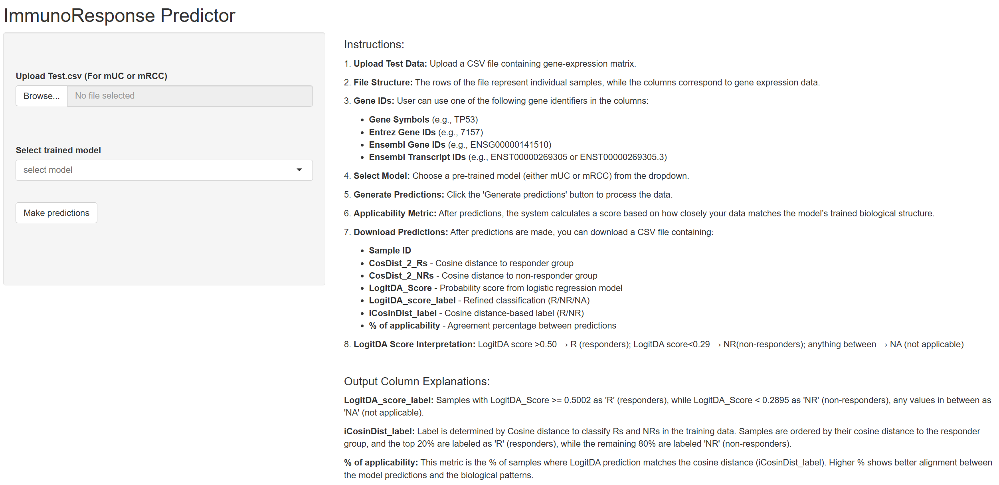
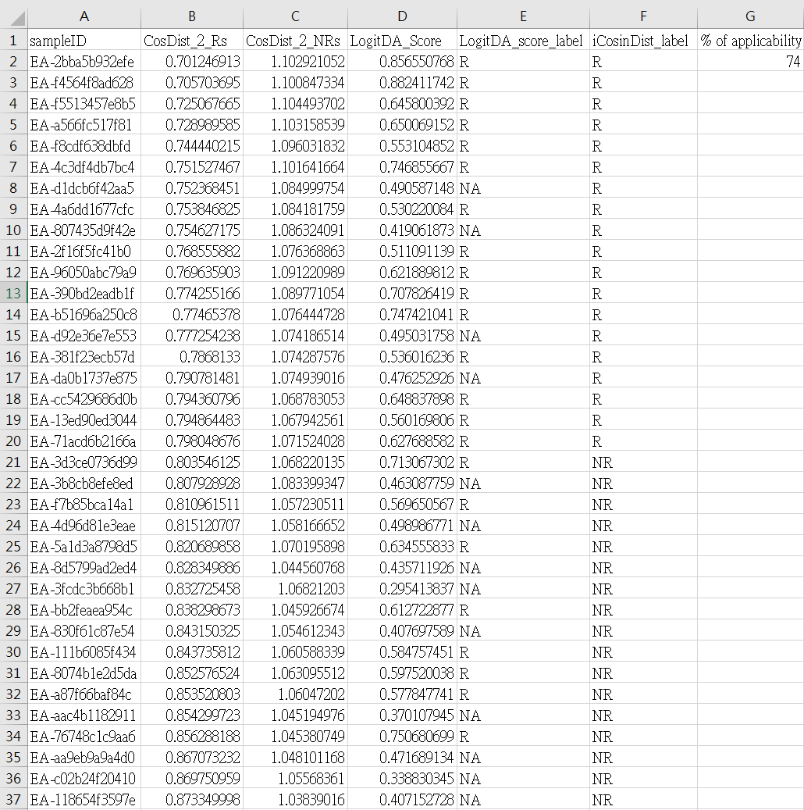

# 🧬 ImmunoResponse Predictor
## Gene Signature for Response Prediction to Immunotherapy and Prognostic Markers in Metastatic Urothelial Carcinoma

This repository contains the code and paper for the ImmunoResponse Predictor GUI. 

📖 Please read the full paper here: [Paper Link](https://pmc.ncbi.nlm.nih.gov/articles/PMC12675356/)

ImmunoResonsePredictor is an interactive R-based Shiny web application that allows users to generate predictions using pre-trained predictors on uploaded test data. The app supports logistic regression models for two different types of cancer: mUC (metastasis urothelial carcinoma) and mRCC (metastasis renal cell carcinoma). Users can upload a test dataset, select a model, and generate predictions, which can then be downloaded as a CSV file for further analysis.

In practice, users upload RNA-seq log2-TPM profile datasets through the GUI. The tool outputs (1) each patient’s cosine distance to responders/non-responders and the corresponding predicted label, and (2) the cohort-level % applicability. High applicability (e.g., >70%) indicates that the new cohort lies in a similar expression space as the training data and that predictions align with the ORR-informed geometric. In such settings, per-patient predictions may support treatment selection or trial enrichment. Low applicability means that the cohort falls outside the model’s applicability domain, and predictions should not be considered to guide clinical decisions.

## User Interface


## Input Data Required
To use the GUI tool, users upload a pre-treatment RNA-seq count or microarray expression matrix (.csv), containing either signature genes or whole-transcriptome data, from biopsy or surgical samples. Gene identifiers may be provided as gene symbols, Entrez IDs, Ensembl gene IDs, or Ensembl transcript IDs.

### Gene IDs

You can use one of the following gene identifiers in the columns:
- Gene Symbols (e.g., TP53)
- Entrez Gene IDs (e.g., 7157)
- Ensembl Gene IDs (e.g., ENSG00000141510)
- Ensembl Transcript IDs (e.g., ENST00000269305)

The GUI accepts gene identifiers such as gene symbols, Entrez IDs, Ensembl gene IDs, or Ensembl transcript IDs on pre-trained models. 
### Gene Panel Requirements

- For **mUC model**, the file must include **49 specific signature genes**.
- For **mRCC model**, the file must include **27 signature genes**.

These input requirements are explicitly described on p. 5, lines 126–132, of the manuscript for users’ reference.

## Select a Pre-Trained Model

Choose from the following pre-trained LogitDA models:
- mUC Model
- mRCC Model

## Generate Predictions

After uploading your file and selecting the model, click on the **Generate predictions** button to process the data.

The system will:
- Match your uploaded gene expression data with required signature genes for the selected model.
- Normalize gene identifiers to reamin the same across the whole dataset.
- Handle missing values/genes by imputing data from training means or replacing missing values with zeros.
- Run predictions using the LogitDA model to classify each sample as Responsive (R) or Non-Responsive (NR).

## Download Predictions

Once predictions are generated, results can be downloaded as a CSV file containing:
- Sample ID
- CosDist_2_Rs - Cosine distance to responder group
- CosDist_2_NRs - Cosine distance to non-responder group
- LogitDA_Score - Probability score from logistic regression model
- LogitDA_score > 0.5 - Binary classification (R/NR)
- LogitDA_score_label - Improved classification (R/NR/NA)
- % of applicability - Matching % between predictions
- iCosinDist_label - Cosine distance-based label (R/NR)

## Output Predictions
### IMvigoz210-PCD4989g (mUC)

The output of IMvigoz210-PCD4989g (mUC) is as follows.

<p align="center">
  
</p>

**Column F** is the predicted labels according to the cutoffs:
- **LogitDA score > 0.50 → R** (responders)
- **LogitDA score < 0.29 → NR** (non-responders)
- **Anything between → NA** (not applicable)

## Output Description
Details on the input/output datasets are provided on the [web tool interface](https://shiehlab.shinyapps.io/immunoresponse-predictor/) and this [GitHub page](https://github.com/DrGroove96/ImmunoResponsePredictor).

## Applicability Interpretation
We define the percentage of applicability by iCosineDist labels, a metric to quantify the applicability of LogitDA predictions to future datasets, as follows:

Applicability (%) = (Number of Matches / Total Number of Samples) × 100, 

where 
- total matches refer to the number of samples whose LogitDA-predicted labels align with those assigned by iCosineDist
- total samples denotes the total number of uploaded test samples

CosineDist measures how close a new sample to the responder (R) and non-responder (NR) groups in the training datasets; however, prediction based on CosineDist requires predefined thresholds, which are difficult to derive in practice. In contrast, iCosineDist incorporates domain knowledge by integrating ORR information for mUC/mRCC. 

Although conservative, this ORR-based ratio is a reasonable reflection of the expected proportion of responders to ICIs in mUC/mRCC and is derived from large-scale clinical datasets

## Requirements

## Step 1. Install Required R Packages:

### R Packages:
- This project uses renv to manage all required packages and their versions.
- The recommended way to install all dependencies is to run in your R console (from the project directory):

  ```r
  install.packages("renv")
  renv::restore()

- or the packages can be installed manually as given below:

  ```r
  Libraries: The following libraries are required:
  install.packages(c(
  "shiny",
  "glmnet",
  "data.table"
  ))

- Install Bioconductor packages
  ```r
    if (!requireNamespace("BiocManager", quietly = TRUE))
  install.packages("BiocManager")
    BiocManager::install(c("sva", "preprocessCore"))

- A user just needs to run in their R console:

  ```r
  source("install.R")


## Step 2: Confirm Directory Structure 
- After installing the packages please check the Shiny App Structure:

- The folder should be arranged as below:


ImmunoResponsePredictor/

 ├── app.R
 
 ├── renv.lock
 
 ├── README.md
 
 ├── Dockerfile
 
 ├── models/
 
 │   ├── logistic-Model-train-muc-test-muc.rds
 
 │   └── logistic-Model-train-rcc-test-rcc.rds


    
- Apart from this you will also need train and test datasets (count matrix) which are not provided here with this Github repository due to copyright and sensitivity issues. The data can be provided upon request. 

## Step 3. Run the Shiny App Locally

A.	Open the main app file:
In RStudio, open app.R.

B.	Run the app:
Click the “Run App” button in RStudio (top-right of the script editor).
Or, in the R console, run:
  ```r
  shiny::runApp()
```

(Ensure the working directory is set to the ImmunoResponsePredictor folder.)

Step 5. Access the app:
-	The Shiny app should open in a browser window.
-	To interact with the app to verify it works use a “Browse” button for uploading .csv files containing gene expression data, 
-	a status indicator will confirm that the “Upload complete”, 
-	then on a dropdown menu select the appropriate pre-trained LogitDA model (mUC or mRCC), and click “Make predictions” button to initiate response prediction on the uploaded data, and 
-	at last, click on “Download predictions” button to export the results in .csv format. 
-	In addition, the interface provides real-time feedback, including the number of rows in the output predictions and confirmation messages upon successful prediction generation.


# 2.  Running the ImmunoResponsePredictor Online:
You can use the GUI directly in your browser without downloading or installing anything locally. Simply visit the following link:

    https://logitda.shinyapps.io/immunoresponsepredictor/

## Important Note for mRCC Model Users
The mRCC model requires intensive preprocessing using "ComBat + Quantile" normalization due to batch effect correction and distribution alignment. These steps are computationally heavy and memory-intensive, making it difficult to run them directly on the hosting server due to RAM limitations.

To address this, we recommend users preprocess their test data locally using the provided preprocess.R script included in the repository.

### Please preprocess your test gene expression matrix using ComBat + Quantile normalization before uploading it to the web app.

## Instructions for Using the Online App
- Upload your preprocessed ```Test.csv``` file.

- Select the desired pre-trained model (```mUC``` or ```mRCC```) from the dropdown.

- Click the “Make predictions” button to initiate processing.

- Download the resulting predictions as a ```.csv``` file.

The app will provide real-time feedback during each step, confirming successful uploads and prediction generation.              


Clone the repository:

```bash
git clone https://github.com/rajatbutola/ImmunoResponsePredictor.git
```
 
### Test Files: Two test files have been uploaded in **Test Files** folder that user can utilize to operate the App.

- **Kim Test Data**: The Kim dataset can also be accessed through "https://www.ncbi.nlm.nih.gov/geo/query/acc.cgi?acc=GSE176307" link. It is open source.
- **Moreno Test Data**: The Moreno dataset can also be accessed through "https://www.ncbi.nlm.nih.gov/geo/query/acc.cgi?acc=GSE111636" link. It is open source.
